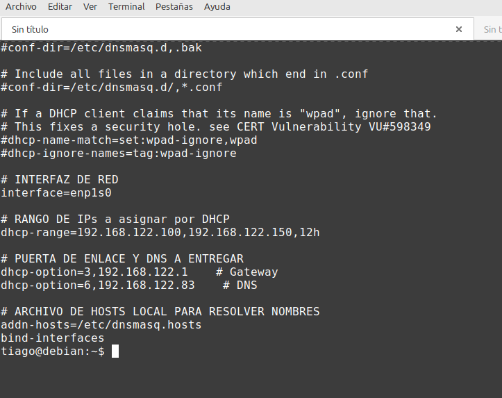
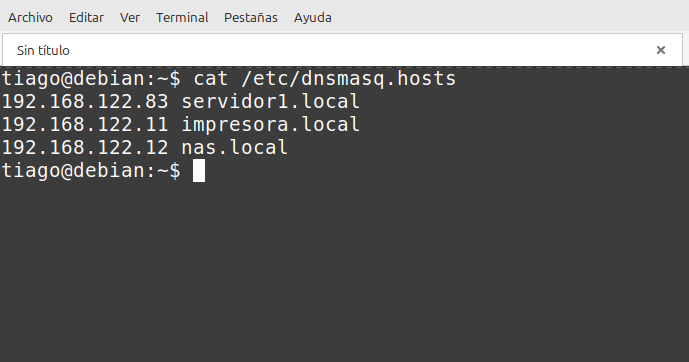
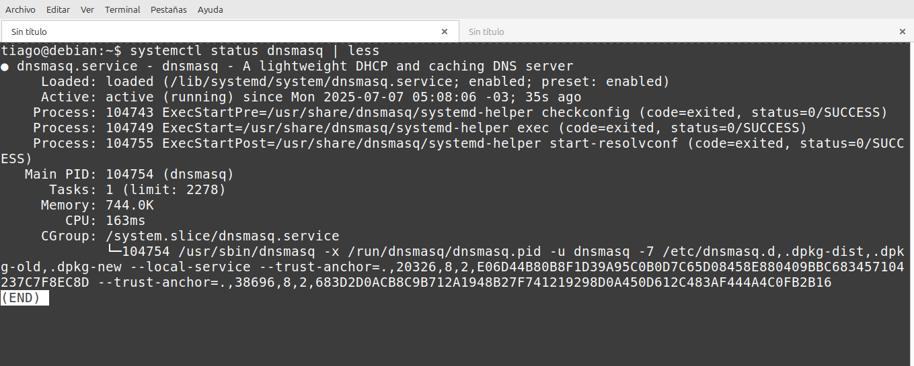
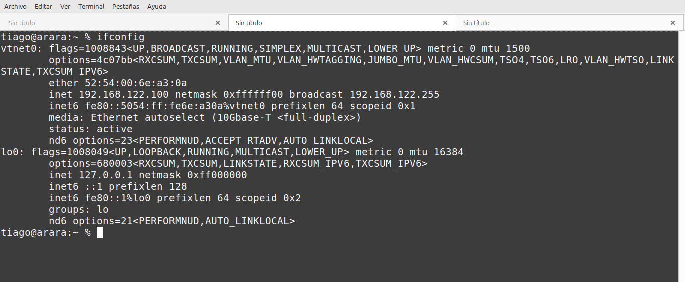
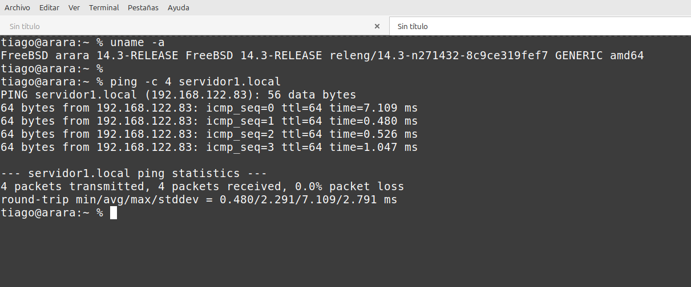

# DHCP and Local DNS Server Configuration with dnsmasq

## Objective

Configure a DHCP server to assign dynamic IPs on the network and a DNS server to resolve local names.

---

## Step 1: View Main Configuration File (`dnsmasq.conf`)

```bash
cat /etc/dnsmasq.conf
```



---

## Step 2: View Local Hosts File (`dnsmasq.hosts`)

```bash
cat /etc/dnsmasq.hosts
```



---

## Step 3: Restart Service and Check Status

```bash
sudo systemctl restart dnsmasq
systemctl status dnsmasq
```



---

## Step 4: Verify IP Assignment on Client

```bash
ifconfig # FreeBSD
```



---

## Step 5: Test Local DNS Resolution

```bash
ping -c 4 servidor1.local
```



---

## Conclusion

The DHCP server correctly assigns IP addresses within the configured range, and the DNS server resolves the defined local names. The configuration works correctly and is ready for use on the local network.