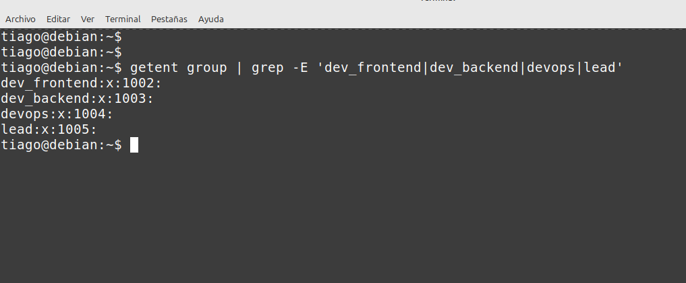
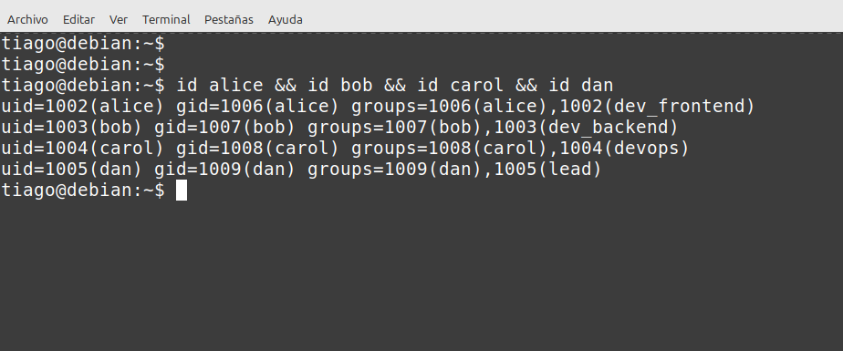
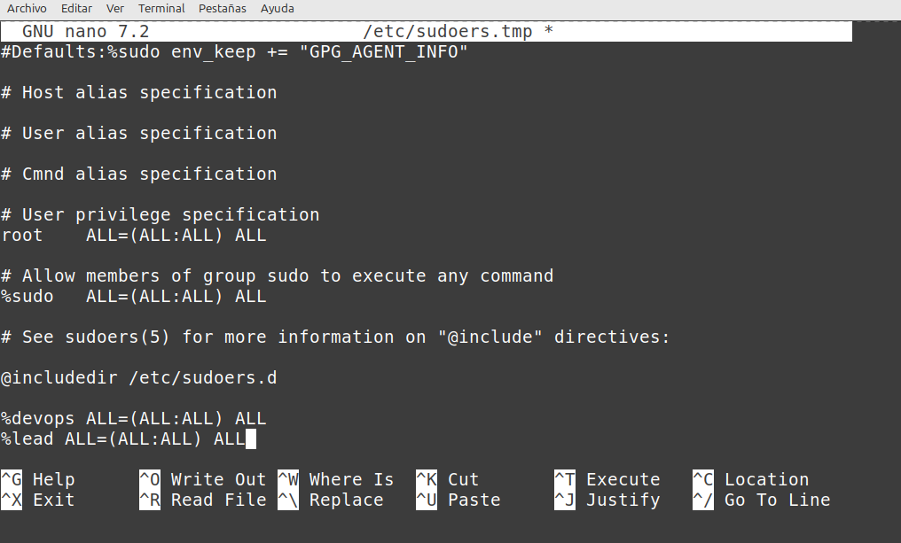
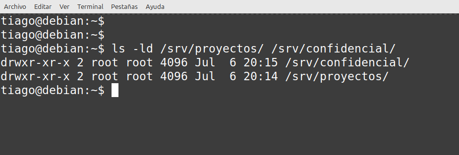
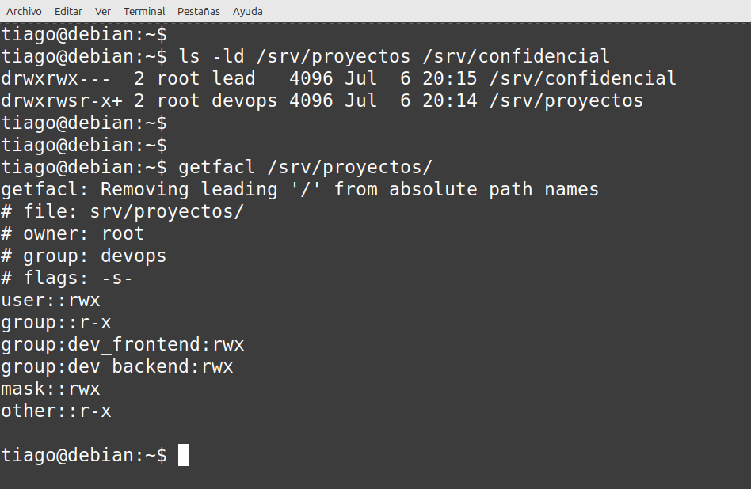
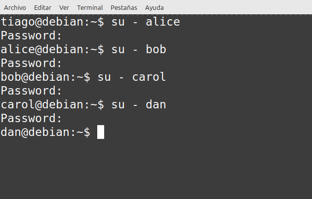
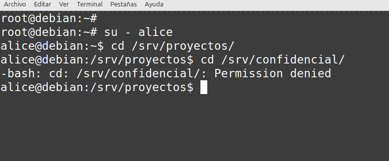
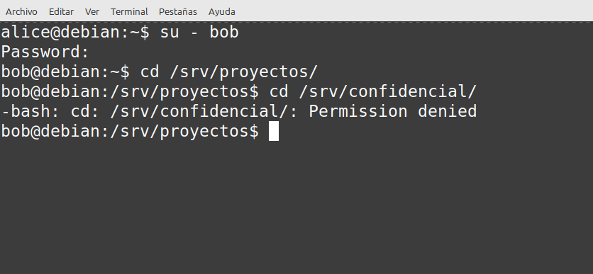
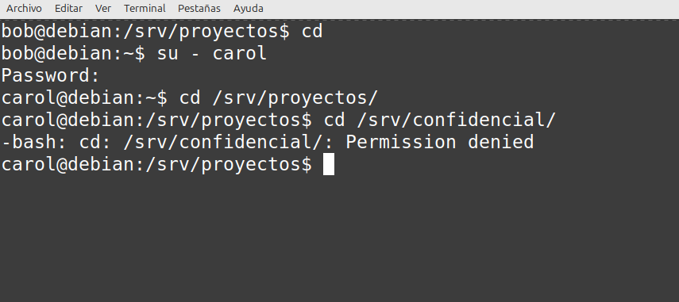
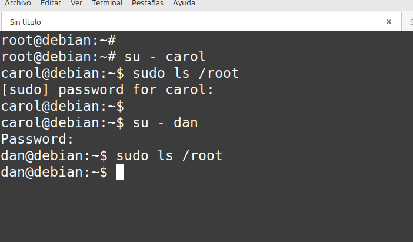

# User Configuration Report on Debian

---

**Date:** 07/06/2025

**Project:** User, Group, and Permission Configuration with ACL on Debian

**Environment:**

* Debian GNU/Linux 12 (verified with `uname -a`)
* Local virtual machine

---

## ✅ Activities Performed

* Created groups: `dev_frontend`, `dev_backend`, `devops`, `lead`
* Created users: `alice`, `bob`, `carol`, and `dan`, each assigned to their respective secondary groups
* Set passwords for each user
* Edited the `sudoers` file to grant sudo privileges to the `devops` and `lead` groups
* Created shared directories: `/srv/proyectos` and `/srv/confidencial`
* Set standard permissions and ACLs:
  * `/srv/proyectos`: accessible by `devops`, `dev_frontend`, and `dev_backend`
  * `/srv/confidencial`: restricted exclusively to the `lead` group
* Applied the `setgid` bit on `/srv/proyectos` to ensure group inheritance
* Verified directory access with each user
* Tested `sudo` access with users `carol` and `dan`

---

## 📷 Evidence

* **Screenshot 1:** Groups created successfully (`groupadd`)  
  

* **Screenshot 2:** Users created and assigned to groups (`useradd`)  
  

* **Screenshot 3:** `sudo` privileges configured in `visudo`  
  

* **Screenshot 4:** Shared directories `/srv/proyectos` and `/srv/confidencial` created  
  

* **Screenshot 5:** Group permissions and ACLs applied (`getfacl`)  
  

* **Screenshot 6:** Access to `/srv/proyectos` and restriction to `/srv/confidencial` for different users  

    
    
    
  

* **Screenshot 7:** `sudo` command execution by `carol` and `dan`  
  
